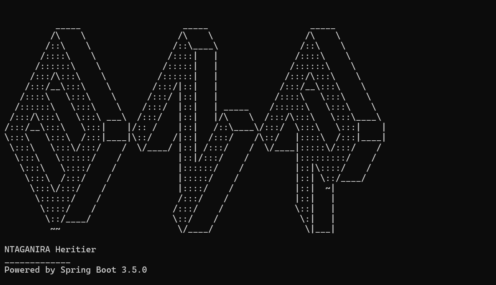

<p align="center">
  
</p>

# Bank Licensing & Compliance Portal

## Overview

The Bank Licensing & Compliance Portal is a regulatory workflow management system designed for the National Bank of Rwanda (NBR).

The platform digitizes and manages the complete lifecycle of bank licensing applications, including:

- Application submission
- Workflow reviews
- Approval and rejection processes
- Audit trail management
- Document uploads and versioning
- Role-based access control
- Regulatory compliance tracking

The system was built as part of a backend engineering assessment focused on:

- Security
- Workflow integrity
- Concurrency handling
- Auditability
- Clean architecture
- Maintainability

---

# Features

## Authentication & Authorization

- JWT-based authentication
- Role-based access control (RBAC)
- Backend-enforced authorization
- Stateless authentication
- Protected API endpoints

Supported roles:

- APPLICANT
- REVIEWER
- APPROVER
- ADMIN

---

## Workflow Management

Applications move through a controlled workflow state machine.

Supported states:

- DRAFT
- SUBMITTED
- UNDER_REVIEW
- NEEDS_MORE_INFO
- RESUBMITTED
- REVIEW_COMPLETED
- APPROVED
- REJECTED

Business rules enforced:

- Illegal transitions are blocked
- Final states are immutable
- Reviewer cannot approve the same application
- Backend validation for all workflow operations

---

## Audit Trail

Every workflow action is permanently recorded.

Audit entries include:

- Acting user
- Action performed
- Previous state
- New state
- Timestamp

Audit logs are append-only and immutable.

---

## Document Management

- Local file storage
- Document metadata persistence
- File versioning
- 5MB server-side upload validation
- Uploader tracking

---

## Concurrency Handling

The system uses optimistic locking via JPA `@Version` fields to prevent inconsistent concurrent updates.

---

# Technology Stack

| Technology | Purpose |
|---|---|
| Java 17 | Backend Runtime |
| Spring Boot 3 | Application Framework |
| Spring Security | Authentication & Authorization |
| JWT | Stateless Authentication |
| Spring Data JPA | Persistence Layer |
| Flyway | Database Migration |
| H2 Database | Development Database |
| Thymeleaf | Frontend Templating |
| Maven | Dependency Management |
| Lombok | Boilerplate Reduction |
| Swagger/OpenAPI | API Documentation |
| Postman | API Testing |

---

# Project Structure

```text
src
├── main
│   ├── java/rw/bnr/heritier
│   │   ├── application
│   │   ├── audit
│   │   ├── auth
│   │   ├── common
│   │   ├── config
│   │   ├── document
│   │   ├── exception
│   │   ├── role
│   │   ├── security
│   │   └── user
│   │
│   └── resources
│       ├── application.yml
│       └── db/migration
│
└── test
```

---

# Setup Instructions

## Prerequisites

Install:

- Java 17+
- Maven 3.9+
- Git

---

## Clone Repository

```bash
git clone https://github.com/Ntaganira/Bnr.git
```

```bash
cd Bnr
```

---

## Build Project

```bash
mvn clean install
```

---

## Run Application

```bash
mvn spring-boot:run
```

Application runs on:

```text
http://localhost:8080
```

---

# H2 Database Console

Access:

```text
http://localhost:8080/h2-console
```

Connection settings:

| Property | Value |
|---|---|
| JDBC URL | jdbc:h2:mem:bankdb |
| Username | sa |
| Password | |

---

# API Documentation

Swagger UI:

```text
http://localhost:8080/swagger-ui/index.html
```

---

# Seeded Users

| Role | Email | Password |
|---|---|---|
| ADMIN | admin@nbr.rw | admin123 |
| REVIEWER | reviewer@nbr.rw | admin123 |
| APPROVER | approver@nbr.rw | admin123 |
| APPLICANT | applicant@nbr.rw | admin123 |

---

# Example Workflow

1. Applicant submits application
2. Reviewer starts review
3. Reviewer completes review
4. Approver approves or rejects application
5. Audit logs generated automatically

---

# Postman Collection

The repository includes:

```text
postman/
├── Bank-Licensing-Portal.postman_collection.json
└── Local.postman_environment.json
```

Import both files into Postman to test APIs.

---

# Testing

Run tests:

```bash
mvn test
```

Planned test coverage includes:

- Workflow transition tests
- Authorization tests
- Concurrency tests
- Integration tests

---

# Security Considerations

- JWT authentication enforced
- Role-based authorization enforced server-side
- Protected workflow transitions
- Immutable audit logging
- File upload validation
- Separation of duties between reviewer and approver

---
# Author

Heritier Ntaganira

---

# License

This project was developed for assessment and demonstration purposes.

